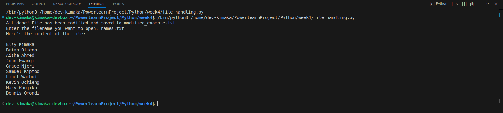

# File Handling and Exception Handling Assignment

## Description

This Python program handles two main tasks:

1. **File Read & Write Challenge**: The program reads the content from a given input file, modifies the content, and writes the modified content to a new file.
2. **Error Handling Lab**: The program asks the user to provide a filename, then reads the file and handles errors if the file does not exist or cannot be read.

## Features

- Reads and writes files with error handling.
- Modifies the file content (for example, converts text to uppercase).
- Handles common file handling errors like:
  - FileNotFoundError: when the file doesn't exist.
  - IOError: when the file cannot be read.
  - General exceptions: for unexpected errors.
  
## Requirements

- Python 3.x
- Basic understanding of file operations (open, read, write).
- Basic understanding of error handling with `try`, `except`.

## Installation

1. Download or clone the repository.
2. Ensure you have Python 3.x installed on your system.
3. Create a file (e.g., `myexample.txt`) to test the script, or use the existing (names.txt) file.
4. Run the program using the command:

   ```bash
   python file_handling.py


## 📸 Example Output

Here’s what the program looks like when reading from `names.txt` and writing to a new file:


